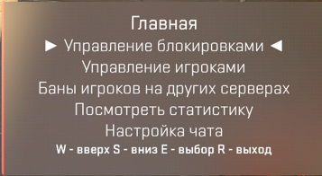

# Пользование админкой в игре.

Пишем в чат<kbd><mark style="color:yellow;">!admin<mark style="color:yellow;"></kbd> открывается следующее окно:

<figure><figcaption></figcaption></figure>

1. Управление блокировками. Здесь мы выдаем муты/гаги/баны/ и также их снимаем.

<figure><figcaption></figcaption></figure>

2.  Управление игроками. Здесь мы можем вызвать человека на проверку, сменить ему ник, кикнуть если он крутилка, а вы младший админ.

    <figure><figcaption></figcaption></figure>

<figure><figcaption></figcaption></figure>

В окне проверки выбираете необходимого игрока, нажимаете E и далее смотрите статистику, она отправляется в консоль, смотрите даты когда его проверяли и вердикты. Если нет статистики или проверяли давно (неделя к примеру) вызываете.&#x20;

3. Всё остальное по факту и не нужно. Можете в настройках чата выключить себе тег админа и замаскироваться.
4. Бинды для админки:\
   Вписываете в консоль следующее.\
   bind \* css\_admin - Вместо звездочки ваша клавиша, нажав на нее сразу откроется админка\
   bind \* css\_check - Вместо звездочки ваша клавиша, нажав на нее сразу откроется окно с проверкой челика.
